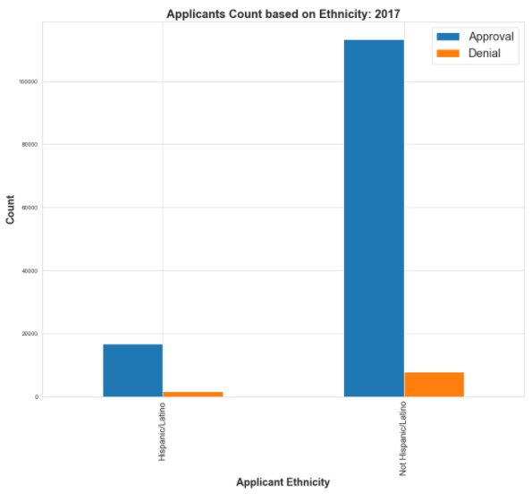
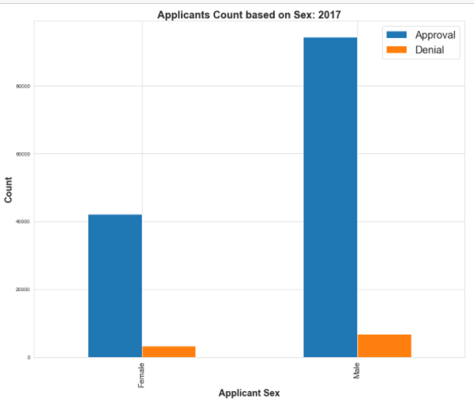

.jpg)
# Mortgage Loan Denial Classification
### Author: Eric Romano
## Overview
Is the real estate industry doing enough to court a new generation of Latino homebuyers? Experts agree that despite progress, the industry has some way to go to fully cater to this growing customer base and take advantage of a lucrative opportunity.
## Business Problem
Due to wealth gap inequality and our current housing market, it is in our best interest to learn what recommendations can provide solutions for these minority groups. To formulate these recommendations, I will create a mortgage application prediction model. From this model, I will present features that have the highest significances in predicting when a mortgage application will be denied. With the fifth of all millennials entering their prime ages to purchase real estate, and of that group another fifth identifies as either Hispanic or Latino this can be seen as a long-term investment that will drive future ROIs. The following are the questions I will answer in this analysis. 
1.	What are the obstacles holding back minority groups, specifically people that identify with the Hispanic/Latinos ethnicity group? 

### Hypotheses
Null Hypothesis (H0): There is no relationship between the HMDA data and Mortgage loan denial predictions
Alternative Hypothesis (Ha): There is a relationship between the HMDA data and Mortgage loan denial predications

## Data Understanding
Each year thousands of Financial institutions provide data about mortgages to the public, under the Home Mortgage Disclosure Act (HMDA). From this you can analysis mortgage trends and learn important insights into why loans get denied. The HMDA data are the most comprehensive publicly available information on mortgage market activity which is used by industry, consumer groups, regulators, and others to assess potential fair lending risks and for other purposes. However, the HMDA data alone cannot be used to determine if lenders are complying with fair lending practices. The data does not include legitimate credit risk considerations for loan approvals and loan pricing decisions. Thus, not having all the necessary information to evaluate if an institution’s compliance with fair lending laws. The data helps the public to assess how financial institutions are serving the housing needs of their local communities. 
The dataset used for this project can be found at:

https://www.consumerfinance.gov/data-research/hmda/historic-data/?geo=nj&records=all-records&field_descriptions=labels 

This dataset contains 349,563 rows and 78 columns.

## Method
The analysis performed in my main Jupiter notebook follows a CRISP-DM method approach. Here I was able to import data from a reputable source, cleaned, processed, scaled, and accounted for the class imbalance. Throughout my exploratory data analysis, I utilized descriptive statistics to determine promising insights and trends withing the mortgage lending process for the year 2017. I was able to organize actionable steps that will help lead to more mortgage approvals. I utilized a Decision Tree for my final model and extracted the optimal hyperparameters with GridSearchCV. I determined the best course of action is to optimize for recall. 

To solve for my class imbalance I experimented with different method such as SMOTE but ended up sticking with the hyperparameter class_weight=’balanced’. 

## Results

## Evaluations
## Conclusion
### Recommendations
### Future Work
## For More Information
## Repository Structure
