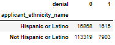
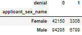

.jpg)
# Mortgage Loan Denial Classification
### Author: Eric Romano
## Overview
Is the real estate industry doing enough to court a new generation of Latino homebuyers? Experts agree that despite progress, the industry has some way to go to fully cater to this growing customer base and take advantage of a lucrative opportunity.
## Business Problem
Due to wealth gap inequality and our current housing market, it is in our best interest to learn what recommendations can provide solutions for these minority groups. To formulate these recommendations, I will create a mortgage application prediction model. From this model, I will present features that have the highest significances in predicting when a mortgage application will be denied. With the fifth of all millennials entering their prime ages to purchase real estate, and of that group another fifth identifies as either Hispanic or Latino this can be seen as a long-term investment that will drive future ROIs. The following are the questions I will answer in this analysis. 
1.	What are the obstacles holding back minority groups, specifically people that identify with the Hispanic/Latinos ethnicity group? 
2.	What are the most important features that go into getting approved for a mortgage loan 
3.	What strategies can be formulated from this analysis to help in obtaining a mortgage loan
4.	Can we create an automated underwriting system with using supervised learning models

### Hypotheses
Null Hypothesis (H0): There is no relationship between the HMDA data and Mortgage loan denial predictions
Alternative Hypothesis (Ha): There is a relationship between the HMDA data and Mortgage loan denial predications

## Data Understanding
Each year thousands of Financial institutions provide data about mortgages to the public, under the Home Mortgage Disclosure Act (HMDA). From this you can analysis mortgage trends and learn important insights into why loans get denied. The HMDA data are the most comprehensive publicly available information on mortgage market activity which is used by industry, consumer groups, regulators, and others to assess potential fair lending risks and for other purposes. However, the HMDA data alone cannot be used to determine if lenders are complying with fair lending practices. The data does not include legitimate credit risk considerations for loan approvals and loan pricing decisions. Thus, not having all the necessary information to evaluate if an institution’s compliance with fair lending laws. The data helps the public to assess how financial institutions are serving the housing needs of their local communities. 
The dataset used for this project can be found at:

[HMDA Mortgage Loan Data](https://www.consumerfinance.gov/data-research/hmda/historic-data/?geo=nj&records=all-records&field_descriptions=labels)

This dataset contains 349,563 rows and 78 columns.

## Method
The analysis performed in my main Jupiter notebook follows a CRISP-DM method approach. Here I was able to import data from a reputable source, cleaned, processed, scaled, and accounted for the class imbalance. Throughout my exploratory data analysis, I utilized descriptive statistics to determine promising insights and trends withing the mortgage lending process for the year 2017. I was able to organize actionable steps that will help lead to more mortgage approvals. I utilized a Decision Tree for my final model and extracted the optimal hyperparameters with GridSearchCV. I determined the best course of action is to optimize for recall. 


To solve for my class imbalance I experimented with different method such as SMOTE but ended up sticking with the hyperparameter class_weight=’balanced’. 

## Results







## Evaluations

This analysis was comprised of two supervised models that were test. The First model used features that did not include reasons of denial to test if the model would pick up any bias against people of color. These models performed terribly with a Recall of about 5%.
The next model I decide to use was a Decision Tree and once again I had a model with bad performance metrics.I used the hyperparameters to solve for out Imbalance class. 

Solved for imbalanced 
>Using The KNN Method weights= ‘distance’:
>
>Precision Score: 0.2776998597475456
>
>Recall Score: 0.07066381156316917
>
>Accuracy Score: 0.9325461190769696
>
>F1 Score: 0.11266002844950213

>Using The Decision Tree Method weighted:
>Precision Score: 0.2100656455142232
>Recall Score: 0.20556745182012848
>Accuracy Score: 0.9050152468695257
>F1 Score: 0.2077922077922078

I decided to feature engineer more varibles that are known to have an impact on the a mortgage loan outcome. I choose to prioritize recall as the metric to gauge the performance of the model. The goal was to limit the number of false negatives. These false negatives, in terms to our business problem, will predict an applicant as worthy of getting approved for a loan even though they should have been rejected. After the housing market crash in 2008, agencies were developed to ensures that banks pay close attention to the affordability of the loan. This will help borrows from obtaining loans that they can afford and prevent future defaults. 

However, when optimizing for recall I was able to obtain a recall of about 87%. This suggest that out of all applicants that applied for a mortgage loan, only 87% of the denial class were identified. My accuracy had decreased to about 87%, implying that my model’s predictions were only 87% correct. Not only did optimizing for recall cost me a decrease in my accuracy, it also took a heavy blow to my F1 score. When optimizing for recall, a better metric to go by, to know the validity of your model’s performance, is your F1 score. Accuracy is used when the True Positives and True negatives are more important while F1-score is used when the False Negatives and False Positives are crucial.


For my final model, I decide to revert to the model before performing a GridSearchCV. In this model I was able to obtain a lower recall of about 73% with an F1 score of 71% which is much more reliable than that of my model where I prioritized recall.


Based on the performance of the model, I reject the null hypothesis that there is no relationship between the HMDA data and a mortgage loan denial.

## Conclusion

In conclusion, the HMDA dataset provides a great resource to gather insights into the process of mortgage lending practices. From just analyzing a given year you can put together actionable recommendations to improve your chances in obtaining a mortgage loan. This machine learning model is like an automated underwriting system used by different lenders. Just like my model there are certain scenarios that will lead the automated underwriting system to deny an applicant of a loan. From here a lender would have to manually underwrite the loan. By leveraging this knowledge, you can implement recommendations that will assist in obtain a mortgage loan.

### Recommendations

1. My first recommendation would be to find lenders that offer you the ability to check whether you will be able to get approved for a mortgage loan without the risk of running your credit. From my analysis I was able to prove that a simple automated underwriting system can be created with the help of machine learning. This will allow you to check without running your credit score, which causes a hard inquiry that has a negative effect on your credit. 
2. For the Hispanic community I will recommend you focus on improving your income as it is high indicator that can determine whether you get approved or denied for the loan.
3. Additionally, to generating more income try to minimize all your liabilities that are affecting your debt to income ratio. Your debt to income ratio is calculated by gathering your monthly fix cost over your monthly gross income. some examples of this month fixed cost are: 
    - Student loans
    - Car loans
    - Insurances
    - Rent
    - Cable/Internet bills
4. In NJ, try not to focus on homes that are considered manufactured. These homes are only covered by an FHA loan which might explain why there is a higher rate of denial. Another downside to these properties is that they will always have a PMI, which is an additional cost and can be very expensive in the long run. 
5. Do not stray away from an FHA loan, these loans are the better option when you have great credit but not have a lot for the down payment. This provides you the flexibility to refinance in the future into a conventional loan at a better rate.

### Future Work

The model can use some tweaking as well as exploring through different algorithms by setting up a pipeline and optimizing for both recall and F1 scores. This take a lot of processing power and can be costly in terms of time consumption. I believe a better use of time is developing other automated tools that can help borrowers make more informed decisions. Some automated tools I plan on making is using this HMDA dataset to predict what interest rate will you potentially get after getting approved. 

I would also like to recreate this analysis with more recent years to compare. I would like to monitor the direction of the Hispanic/Latino market and provide better data driven decisions solutions to problems they are facing.

## For More Information
Please review my full analysis in my [Jupyter Notebook](https://github.com/Eric-G-Romano/dsc-phase-3-project/blob/main/Mortgage%20Loan%20Denial%20Classification.ipynb) or my [presentation]().

For any additional questions, please contact **Eric Romano** at [egustavo4@gmail.com](egustavo94@gmail.com).

## Repository Structure

```bash

├── README.md                                   < The top-level README for reviewers of this project
├── Mortgage_Loan_Denial_Classification.ipynb   < Narrative documentation of analysis in Jupyter notebook
├── Mortgage_Loan_Denial_Classification.pdf     < PDF version of project presentation
├── Mortgage_Loan_Denial_Classification.pdf     < PDF version of Jupyter notebook
├── data                                        < CSV file used for this project
├── image                                       < Visualizations generated for analysis
└── images                                      < Visualizations generated for analysis
```
